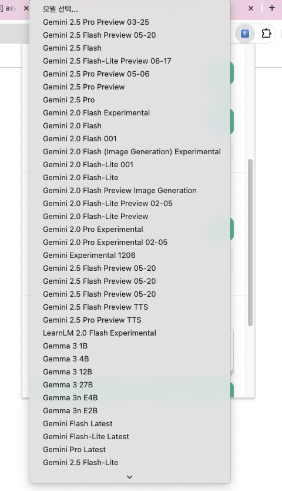

# 한글 맞춤법 검사기 (Korean Spell Checker)


**Grammarly 스타일의 직관적인 UI로 한글 맞춤법을 AI가 검사하는 Chrome 확장 프로그램**

드래그만 하면 자동으로 검사 버튼이 나타나는 혁신적인 경험! ✨

## 🎬 데모


https://github.com/user-attachments/assets/e815fab7-b69f-4727-b937-35970ae591e6


*텍스트를 드래그하면 "맞춤법 검사" 버튼이 자동으로 나타납니다! 또는 단축키를 누르거나 우클릭하세요.*


https://github.com/user-attachments/assets/804e381d-7805-4aa0-8bb3-1f6073f0ba92


*Goole sheet ,Goole Docs Chrome이면 어디서든 사용 가능합니다.*

## 📸 스크린샷

### 확장 프로그램 팝업


*Gemini API 설정, 모델 선택, 텍스트 교정 테스트 기능을 제공합니다.*

### AI 모델 선택 (30+ 모델 지원! 🤖)




*Gemini 2.5 Pro/Flash, Gemini 2.0 Experimental, Gemma 3 (1B~27B), LearnLM 등 **30개 이상의 최신 AI 모델**을 자유롭게 선택할 수 있습니다!*

### 맞춤법 교정 결과


*선택한 텍스트의 오류를 자동으로 감지하고 교정 제안을 제공합니다.*

## 🎉 최신 기능 (v6.3.0)

### 플로팅 버튼 🆕
텍스트를 드래그하면 마우스 커서 근처에 "맞춤법 검사" 버튼이 자동으로 나타납니다. 우클릭이나 단축키 없이 즉시 검사 가능!

### 30+ AI 모델 지원 🤖
Gemini 2.5, 2.0, Gemma 3, LearnLM 등 **30개 이상의 최신 AI 모델**을 선택할 수 있습니다. 빠른 응답이 필요하면 Flash, 고품질이 필요하면 Pro 시리즈를 선택하세요!

### 선택적 수정 적용 🎯
모든 수정을 한 번에 적용하지 않고, 원하는 수정만 골라서 적용할 수 있습니다. 이전/다음 버튼으로 순회하며 개별 승인/거절 가능!

### 커스텀 단축키 ⌨️
입력 필드에서 원하는 키 조합을 직접 눌러 설정하세요. F1, Cmd+K, Shift+Q 등 모든 키 조합 가능!

### 2단 레이아웃 📐
네이버 맞춤법 검사기 스타일의 직관적인 비교 화면. 원문과 교정 결과를 나란히 확인하세요.

## ✨ 주요 기능

### 🎯 검사 방법 (3가지 중 선택!)
1. **플로팅 버튼** 🆕 - 텍스트 드래그하면 자동으로 "맞춤법 검사" 버튼 등장
2. **커스텀 단축키** ⌨️ - 원하는 키 조합으로 설정 가능 (F1, Cmd+E, Shift+K 등)
3. **우클릭 메뉴** 🖱️ - 텍스트 선택 후 우클릭 → "맞춤법 검사"

### 💎 교정 결과 (Grammarly 스타일)
- **2단 레이아웃**: 원문 vs 교정 결과를 나란히 비교
- **변경 사항 강조**: 삭제(빨간 strikethrough) / 추가(초록 배경)
- **선택적 적용**: 각 수정 사항을 개별적으로 승인/거절 가능
- **네비게이션**: 이전/다음 버튼으로 수정 사항 순회
- **전체 제어**: 전체 적용/거절 버튼으로 한 번에 처리
- **호버 툴팁**: 교정된 단어에 마우스 올리면 상세 이유 표시

### 🤖 AI 엔진 (30+ 모델 지원!)
- **Gemini 2.5 시리즈**: Pro Preview, Flash Preview (최신 모델)
- **Gemini 2.0 시리즈**: Flash Experimental, Image Generation 지원
- **Gemma 3 시리즈**: 1B, 4B, 12B, 27B 등 다양한 크기
- **LearnLM 2.0**: 학습 특화 모델
- **실시간 업데이트**: 최신 모델 자동 감지 및 추가
- **자유로운 선택**: 30개 이상의 모델 중 목적에 맞게 선택

### ⚙️ 사용자 설정
- **단축키 커스터마이징**: 입력 필드에서 원하는 키 조합을 직접 입력
- **API Key 관리**: Gemini API Key 저장 및 관리
- **테스트 기능**: 팝업에서 즉시 테스트 가능

## 📦 설치 방법

### 방법 1: Chrome 웹 스토어 (예정)
곧 Chrome 웹 스토어에서 원클릭 설치가 가능합니다.

### 방법 2: 로컬 설치 (개발자용)

#### Step 1: 레포지토리 다운로드
```bash
# Git으로 클론
git clone https://github.com/sehyunsix/korean-error-correction-extension.git
cd korean-error-correction-extension

# 또는 ZIP 다운로드
# https://github.com/sehyunsix/korean-error-correction-extension
# → Code → Download ZIP → 압축 해제
```

#### Step 2: Chrome에 확장 프로그램 로드
1. Chrome 브라우저에서 `chrome://extensions/` 접속
2. 우측 상단의 **"개발자 모드"** 토글 활성화
3. **"압축해제된 확장 프로그램을 로드합니다"** 버튼 클릭
4. 다운로드한 폴더 내의 **`korean-error-correction`** 폴더 선택
5. ✅ 설치 완료! 브라우저 우측 상단에 확장 프로그램 아이콘 표시

#### Step 3: 초기 설정 (선택사항)
1. 확장 프로그램 아이콘 클릭
2. **"⌨️ 단축키 설정"**에서 원하는 단축키 설정 (권장: F1 또는 Cmd+E)
3. **"🤖 AI 엔진 설정"**에서 Gemini API Key 입력 (더 나은 품질을 원할 경우)
4. 🔄 버튼으로 30개 이상의 AI 모델 목록 로드
5. 원하는 모델 선택 후 **저장**

> 💡 **팁**: API Key 없이도 기본 기능 사용 가능합니다!

## ⚡ 빠른 시작 (5초 완성!)

설치 후 바로 사용하는 방법:

1. **아무 웹페이지**에서 한글 텍스트 드래그 (예: "이거는 맞춤뻡이 틀렸다")
2. 나타난 **"맞춤법 검사" 버튼** 클릭 ✨
3. **교정 결과 확인** 후 원하는 수정만 적용!

> 🎉 **끝!** 더 이상의 설정은 필요 없습니다.

### 추가 설정 (선택)
- **단축키 변경**: 확장 프로그램 아이콘 → ⌨️ 단축키 설정
- **AI 모델 선택**: API Key 입력 → 30+ 모델 중 선택
- **테스트**: 팝업에서 즉시 테스트 가능

## 🚀 사용 방법 (상세)

### 방법 1: 플로팅 버튼 (권장! 🆕)
1. 웹페이지에서 검사할 **한글 텍스트를 드래그**
2. 마우스 커서 근처에 **"맞춤법 검사" 버튼** 자동 등장
3. 버튼 클릭하면 즉시 검사 시작!

### 방법 2: 커스텀 단축키
1. 확장 프로그램 아이콘 클릭 → **"⌨️ 단축키 설정"**
2. 입력 필드 클릭 후 **원하는 키 조합 입력** (예: F1, Cmd+K)
3. 저장 후 텍스트 선택하고 **설정한 단축키** 누르기

### 방법 3: 우클릭 메뉴
1. 텍스트 선택 후 **우클릭**
2. "맞춤법 검사" 메뉴 클릭

### 교정 결과 사용하기
1. **2단 레이아웃**에서 원문과 교정 결과 비교
2. **개별 수정 항목**에서:
   - **✓ 적용**: 해당 수정 승인
   - **✕ 거절**: 해당 수정 거절
3. **이전/다음 버튼**으로 수정 사항 순회
4. **전체 적용/거절** 버튼으로 한 번에 처리
5. **수정하기** 버튼: 승인된 수정만 원문에 적용
6. **복사하기** 버튼: 최종 텍스트를 클립보드에 복사

### Gemini API 설정 (선택사항)
1. [Google AI Studio](https://aistudio.google.com/app/apikey)에서 **API Key 발급**
2. 확장 프로그램 아이콘 클릭
3. **"🤖 AI 엔진 설정"** 섹션에서 API Key 입력 후 **저장**
4. 🔄 버튼을 눌러 **30개 이상의 모델 목록** 자동 로드
5. 드롭다운에서 원하는 **모델 선택**:
   - **빠른 응답**: `gemini-2.0-flash-exp`, `gemini-flash-latest`
   - **고품질**: `gemini-2.5-pro-preview`, `gemini-pro-latest`
   - **실험적 기능**: Image Generation, TTS 지원 모델
   - **경량 모델**: Gemma 3 시리즈 (1B, 4B 등)

### 팝업 테스트 기능
1. 확장 프로그램 아이콘 클릭
2. **"🧪 AI 교정 테스트"** 섹션에서 텍스트 입력
3. **"교정하기"** 버튼 클릭
4. 교정 결과 확인 후 **복사** 버튼으로 복사

## 🏗️ 프로젝트 구조

```
korean-error-correction-extension/
├── korean-error-correction/        # 📦 확장 프로그램 메인
│   ├── modules/                   # 🧩 모듈화된 코드
│   │   ├── config.js              # ⚙️ 설정 및 규칙
│   │   ├── storage.js             # 💾 Chrome Storage API 관리
│   │   ├── gemini-api.js          # 🤖 Gemini API (30+ 모델)
│   │   ├── text-utils.js          # 📝 텍스트 처리 유틸리티
│   │   └── ui-highlight.js        # 🎨 오류 하이라이트 & 툴팁
│   ├── docs/                      # 📚 문서
│   │   ├── API_ERROR_GUIDE.md     # API 오류 해결
│   │   ├── LOG_GUIDE.md           # 로그 가이드
│   │   └── PRE_COMMIT_GUIDE.md    # Pre-commit hook
│   ├── content.js                 # 🎯 Content script
│   │                               #   - 플로팅 버튼 (v6.3.0)
│   │                               #   - 커스텀 단축키 (v6.2.0)
│   │                               #   - 선택적 수정 적용 (v6.0.0)
│   │                               #   - 2단 레이아웃 모달
│   ├── popup.js                   # 🎨 Popup UI 로직
│   │                               #   - AI 모델 선택 (30+ 모델)
│   │                               #   - 단축키 설정
│   │                               #   - 테스트 기능
│   ├── popup.html                 # 📄 Popup HTML (Grammarly 스타일)
│   ├── background.js              # ⚡ Background script
│   ├── styles.css                 # 🎨 CSS 스타일
│   └── manifest.json              # 📋 Extension manifest (v6.3.0)
├── model-select.png               # 🖼️ AI 모델 선택 스크린샷
├── docs/                          # 📖 프로젝트 문서
│   ├── CHANGELOG.md               # 📝 변경 이력
│   ├── SETUP_GUIDE.md             # 🚀 설치 가이드
│   └── SYNTAX_CHECK.md            # ✅ Syntax 검사
└── README.md                      # 📘 이 파일
```

## 🎨 핵심 기능별 코드 위치

### 플로팅 버튼 🆕
- **파일**: `content.js` (라인 1641~1807)
- **기능**: 텍스트 드래그 시 자동 버튼 표시
- **포함**: Grammarly 스타일 UI, 애니메이션

### 선택적 수정 적용 🎯
- **파일**: `content.js` (라인 213~524)
- **기능**: 개별 수정 승인/거절, 네비게이션
- **포함**: 상태 관리, 최종 텍스트 생성

### 커스텀 단축키 ⌨️
- **파일**: `content.js` (라인 1494~1549), `popup.js` (라인 656~830)
- **기능**: 키보드 입력으로 단축키 설정
- **포함**: 모든 키 조합 지원

### AI 모델 선택 (30+ 모델) 🤖
- **파일**: `modules/gemini-api.js`, `popup.js`
- **기능**: Gemini API 모델 목록 자동 로드
- **지원**: Gemini 2.5/2.0, Gemma 3, LearnLM

## 🛠️ 개발

### Pre-commit Hook
JavaScript syntax 자동 검사가 설정되어 있습니다:
```bash
# Commit 시 자동으로 syntax 검사
git commit -m "your message"
```

### 수동 Syntax 검사
```bash
# 특정 파일
node --check korean-error-correction/content.js

# 모든 JS 파일
find korean-error-correction -name "*.js" -not -path "*/node_modules/*" -exec node --check {} \;
```

## 📚 문서

- [API 오류 해결 가이드](korean-error-correction/docs/API_ERROR_GUIDE.md)
- [로그 출력 가이드](korean-error-correction/docs/LOG_GUIDE.md)
- [Pre-commit Hook 가이드](korean-error-correction/docs/PRE_COMMIT_GUIDE.md)
- [변경 이력](docs/CHANGELOG.md)
- [설치 가이드](docs/SETUP_GUIDE.md)

## 🐛 문제 해결

### 플로팅 버튼이 나타나지 않아요
1. 한글이 포함된 텍스트를 드래그했는지 확인
2. 웹페이지 **새로고침** (F5)
3. 확장 프로그램 **재설치** 시도

### 단축키가 작동하지 않아요
1. 팝업 → **"⌨️ 단축키 설정"**에서 단축키 재설정
2. 다른 확장 프로그램이나 브라우저와 충돌하지 않는 키 선택 (예: F1, F2)
3. 웹페이지 **새로고침** (F5)

### 수정 사항이 적용되지 않아요
1. 수정 항목에서 **✓ 적용** 버튼이 활성화되어 있는지 확인
2. **수정하기** 버튼을 클릭했는지 확인
3. contenteditable 요소에서는 **복사하기** 사용 권장

### Gemini API 오류 (404, 403)
1. 팝업에서 **🔄 버튼**을 눌러 모델 목록 새로고침
2. **다른 모델** 선택 (권장: `gemini-1.5-flash-latest`)
3. API Key가 **유효한지** 확인

### 상세한 로그 확인
- **웹페이지**: F12 → Console 탭
- **Service Worker**: chrome://extensions/ → Service worker 링크 클릭

## 📝 라이선스

MIT License - 자유롭게 사용, 수정, 배포 가능합니다.

## 🤝 기여

Pull Request와 Issue는 언제나 환영합니다!

1. Fork the project
2. Create your feature branch (`git checkout -b feature/AmazingFeature`)
3. Commit your changes (`git commit -m 'Add some AmazingFeature'`)
4. Push to the branch (`git push origin feature/AmazingFeature`)
5. Open a Pull Request

## 📞 문의

문제가 있거나 제안사항이 있으시면 [Issue](https://github.com/your-username/korean-error-correction/issues)를 등록해주세요.

---

**Made with ❤️ for Korean writers**
