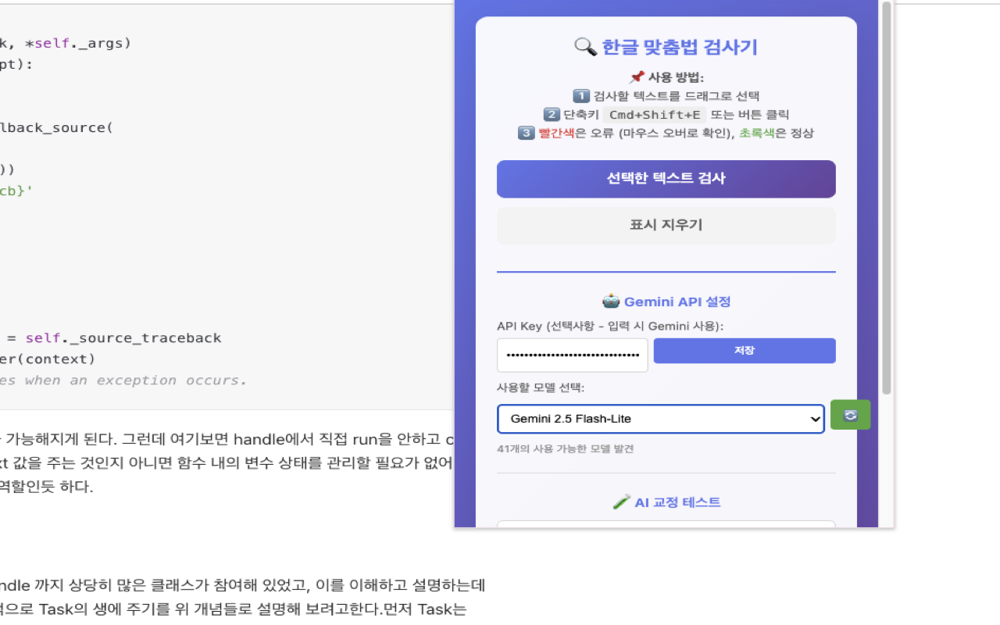

# 한글 맞춤법 검사기 (Korean Spell Checker)


**선택한 텍스트의 맞춤법을 Gemini AI로 빠르고 정확하게 검사하는 Chrome 확장 프로그램**

## 🎬 데모


*텍스트를 선택하고 `Cmd+Shift+E`를 누르면 맞춤법 검사가 실행됩니다!*

## 📸 스크린샷

### 확장 프로그램 팝업



*Gemini API 설정, 모델 선택, 텍스트 교정 테스트 기능을 제공합니다.*

### 맞춤법 교정 결과


*선택한 텍스트의 오류를 자동으로 감지하고 교정 제안을 제공합니다.*

## ✨ 주요 기능

- 🎯 **선택 텍스트 검사**: 원하는 텍스트만 선택해서 검사
- 🤖 **Gemini AI 지원**: Google Gemini API로 정확한 맞춤법 검사
- 🎨 **직관적인 표시**: 오류는 빨간색, 정상은 초록색으로 표시
- 💬 **툴팁 제안**: 마우스를 올리면 교정 제안과 설명 확인
- ⌨️ **단축키 지원**: `Cmd+Shift+E` (Mac) / `Ctrl+Shift+E` (Windows)
- 🔄 **모델 선택**: 사용 가능한 Gemini 모델 중 선택 가능
- 📊 **테스트 기능**: 팝업에서 직접 텍스트 입력 및 교정 테스트

## 📦 설치 방법

### 1. Chrome 웹 스토어 (예정)
곧 Chrome 웹 스토어에서 다운로드 가능합니다.

### 2. 로컬 설치
```bash
# 1. 레포지토리 클론
git clone https://github.com/your-username/korean-error-correction.git
cd korean-error-correction

# 2. Chrome에서 설치
# chrome://extensions/ 접속
# → "개발자 모드" 활성화
# → "압축해제된 확장 프로그램을 로드합니다" 클릭
# → "korean-error-correction" 폴더 선택
```

## 🚀 사용 방법

### 기본 사용법
1. 웹페이지에서 검사할 **한글 텍스트를 드래그로 선택**
2. **단축키 `Cmd+Shift+E`** 누르기 (또는 확장 프로그램 아이콘 클릭)
3. 빨간색으로 표시된 **오류에 마우스를 올리면** 교정 제안 확인
4. 초록색은 오류 없음 (3초 후 자동 사라짐)

### Gemini API 설정 (선택사항)
1. [Google AI Studio](https://aistudio.google.com/app/apikey)에서 **API Key 발급**
2. 확장 프로그램 아이콘 클릭
3. **"Gemini API 설정"** 섹션에서 API Key 입력 후 **저장**
4. 🔄 버튼을 눌러 **사용 가능한 모델 목록** 확인
5. 원하는 **모델 선택** (권장: `gemini-1.5-flash-latest`)

### 팝업 테스트 기능
1. 확장 프로그램 아이콘 클릭
2. **"🧪 AI 교정 테스트"** 섹션에서 텍스트 입력
3. **"교정하기"** 버튼 클릭
4. 교정 결과 확인 후 **복사** 버튼으로 복사

## 🏗️ 프로젝트 구조

```
korean-error-correction/
├── korean-error-correction/        # 확장 프로그램 메인
│   ├── modules/                   # 모듈화된 코드
│   │   ├── config.js              # 설정
│   │   ├── storage.js             # Storage 관리
│   │   ├── gemini-api.js          # Gemini API
│   │   ├── text-utils.js          # 텍스트 유틸리티
│   │   └── ui-highlight.js        # UI 하이라이트
│   ├── docs/                      # 문서
│   │   ├── API_ERROR_GUIDE.md     # API 오류 해결 가이드
│   │   ├── LOG_GUIDE.md           # 로그 출력 가이드
│   │   └── PRE_COMMIT_GUIDE.md    # Pre-commit hook 가이드
│   ├── content.js                 # Content script (메인 로직)
│   ├── popup.js                   # Popup UI 로직
│   ├── background.js              # Background script
│   ├── popup.html                 # Popup HTML
│   ├── styles.css                 # CSS
│   └── manifest.json              # Extension manifest
├── docs/                          # 프로젝트 문서
│   ├── CHANGELOG.md               # 변경 이력
│   ├── SETUP_GUIDE.md             # 설치 가이드
│   └── SYNTAX_CHECK.md            # Syntax 검사 가이드
└── README.md                      # 이 파일
```

## 🎨 모듈 구조

확장 프로그램은 **가독성과 유지보수**를 위해 모듈화되어 있습니다:

- **config.js**: 설정 및 규칙
- **storage.js**: Chrome Storage API 관리
- **gemini-api.js**: Gemini API 호출 및 오류 처리
- **text-utils.js**: 텍스트 처리 유틸리티
- **ui-highlight.js**: 오류 하이라이트 및 툴팁 UI

## 🛠️ 개발

### Pre-commit Hook
JavaScript syntax 자동 검사가 설정되어 있습니다:
```bash
# Commit 시 자동으로 syntax 검사
git commit -m "your message"
```

### 수동 Syntax 검사
```bash
# 특정 파일
node --check korean-error-correction/content.js

# 모든 JS 파일
find korean-error-correction -name "*.js" -not -path "*/node_modules/*" -exec node --check {} \;
```

## 📚 문서

- [API 오류 해결 가이드](korean-error-correction/docs/API_ERROR_GUIDE.md)
- [로그 출력 가이드](korean-error-correction/docs/LOG_GUIDE.md)
- [Pre-commit Hook 가이드](korean-error-correction/docs/PRE_COMMIT_GUIDE.md)
- [변경 이력](docs/CHANGELOG.md)
- [설치 가이드](docs/SETUP_GUIDE.md)

## 🐛 문제 해결

### 단축키가 작동하지 않아요
1. `chrome://extensions/` → 확장 프로그램 **새로고침**
2. `chrome://extensions/shortcuts` → 단축키 확인 및 재설정
3. 웹페이지 **새로고침** (F5)

### Gemini API 오류 (404, 403)
1. 팝업에서 **🔄 버튼**을 눌러 모델 목록 새로고침
2. **다른 모델** 선택 (권장: `gemini-1.5-flash-latest`)
3. API Key가 **유효한지** 확인

### 상세한 로그 확인
- **웹페이지**: F12 → Console 탭
- **Service Worker**: chrome://extensions/ → Service worker 링크 클릭

## 📝 라이선스

MIT License - 자유롭게 사용, 수정, 배포 가능합니다.

## 🤝 기여

Pull Request와 Issue는 언제나 환영합니다!

1. Fork the project
2. Create your feature branch (`git checkout -b feature/AmazingFeature`)
3. Commit your changes (`git commit -m 'Add some AmazingFeature'`)
4. Push to the branch (`git push origin feature/AmazingFeature`)
5. Open a Pull Request

## 📞 문의

문제가 있거나 제안사항이 있으시면 [Issue](https://github.com/your-username/korean-error-correction/issues)를 등록해주세요.

---

**Made with ❤️ for Korean writers**
