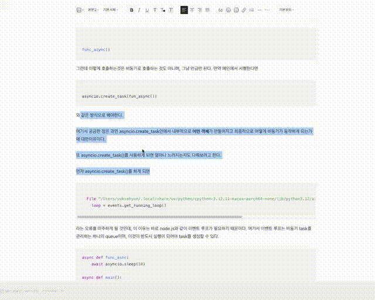

# 🔍 한글 맞춤법 검사기 Chrome 확장 프로그램


**선택한 텍스트의 맞춤법을 AI로 검사하고 자동으로 교정해주는 Chrome 확장 프로그램입니다.**

## 🎬 데모



텍스트를 선택하고 `Cmd+Shift+E`를 누르면 맞춤법 검사가 실행됩니다!

## 📖 사용 방법

### 1️⃣ **기본 사용법** (선택한 텍스트 검사)

1. **웹페이지에서 텍스트를 선택**하세요 (마우스로 드래그)

2. **단축키 `Cmd+Shift+E` (Mac) 또는 `Ctrl+Shift+E` (Windows)** 를 누르세요

3. **모달에서 결과 확인**:
   - ❌ **수정 전**: 틀린 부분이 빨간색으로 표시됨
   - ✅ **수정 후**: 교정된 텍스트 표시

4. **두 가지 옵션 선택**:
   - **✏️ 수정하기**: 클릭하면 선택한 텍스트가 자동으로 교정됨 (추천!)
   - **📋 복사**: 교정된 텍스트를 클립보드에 복사

### 2️⃣ **Tistory/iframe 에디터에서 사용**

1. 에디터에서 텍스트 선택

2. `Cmd+Shift+E` 실행

3. "✏️ 수정하기" 버튼 클릭

4. **자동으로 텍스트가 교정**됩니다! 🎉

### 3️⃣ **팝업에서 직접 입력하여 검사**

1. 확장 프로그램 아이콘 클릭

2. **Gemini API 키** 입력 및 저장 ([API 키 발급](https://aistudio.google.com/app/apikey))

3. 텍스트 입력 후 **"교정하기"** 버튼 클릭

4. 교정된 결과를 바로 복사 가능

### ⚙️ **Gemini 모델 선택**

1. 팝업에서 API 키 입력

2. 자동으로 사용 가능한 모델 목록이 표시됨

3. 원하는 모델 선택 (기본: `gemini-flash-lite-latest`)

4. 🔄 버튼으로 모델 목록 새로고침

## ✨ 주요 기능

- 🤖 **Google Gemini AI 기반**: 최신 AI 모델을 사용한 정확한 맞춤법 검사
- ⌨️ **단축키 지원**: `Cmd+Shift+E`로 빠른 검사
- 🎯 **선택 영역만 검사**: 페이지 전체가 아닌 선택한 부분만 검사
- ✏️ **자동 수정**: "수정하기" 버튼으로 원클릭 텍스트 교정
- 🖼️ **iframe 지원**: Tistory, WordPress 등 iframe 에디터 완벽 지원
- 🔴 **시각적 표시**: 틀린 부분을 빨간색으로 강조, 툴팁으로 제안 표시
- 📋 **복사 기능**: 교정된 텍스트를 클립보드에 복사
- 🎨 **인라인 오류 표시**: 수정 전 텍스트에 오류를 직접 표시
- 💻 **기술 용어 인식**: JavaScript, React, API 등 프로그래밍 용어는 오류로 판단하지 않음
- 📊 **모델 선택**: 사용 가능한 Gemini 모델을 선택하여 사용

## 🚀 설치 방법

### 1. Chrome 확장 프로그램 설치

1. Chrome 브라우저에서 `chrome://extensions/` 접속

2. 우측 상단의 **개발자 모드** 활성화

3. **압축해제된 확장 프로그램을 로드합니다** 클릭

4. `korean-error-correction` 폴더 선택

5. 확장 프로그램이 설치됩니다!

### 2. Gemini API 키 설정 (필수)

1. [Google AI Studio](https://aistudio.google.com/app/apikey)에서 **무료 API 키 발급**

2. 확장 프로그램 아이콘 클릭

3. **"Gemini API Key"** 입력란에 발급받은 API 키 입력

4. **"저장"** 버튼 클릭

5. 완료! 이제 사용 가능합니다! 🎉

### 3. 단축키 확인 (선택사항)

1. `chrome://extensions/shortcuts` 접속

2. "한글 맞춤법 검사기" 찾기

3. 단축키 확인: **`Cmd+Shift+E`** (Mac) / **`Ctrl+Shift+E`** (Windows)

4. 필요시 단축키 변경 가능

### ⚙️ 코드를 수정한 경우

코드를 수정한 후에는 반드시 확장 프로그램을 **새로고침**해야 합니다:
1. `chrome://extensions/` 페이지로 이동
2. "한글 맞춤법 검사기" 확장 프로그램의 새로고침 버튼(🔄) 클릭
3. 테스트하려는 웹페이지도 새로고침

## 🎯 주요 검사 항목

Google Gemini AI가 다음과 같은 맞춤법 오류를 정확하게 감지합니다:

### 흔한 맞춤법 오류
- ❌ 않돼요 → ✅ 안 돼요
- ❌ 않되 → ✅ 안 되
- ❌ 되요 → ✅ 돼요
- ❌ 어떻해 → ✅ 어떡해
- ❌ 웬지 → ✅ 왠지
- ❌ 왠일 → ✅ 웬일

### 띄어쓰기 오류
- ❌ 할수있다 → ✅ 할 수 있다
- ❌ 그럼에도불구하고 → ✅ 그럼에도 불구하고
- ❌ 그런데도 → ✅ 그런데도

### 문법 오류
- 조사 사용 오류
- 시제 오류
- 높임말 오류

### 💻 기술 용어 제외
다음 용어들은 오류로 판단하지 않습니다:
- 프로그래밍 언어: JavaScript, Python, React, TypeScript 등
- 기술 용어: API, HTTP, JSON, CSS, HTML 등
- 함수명/변수명: useState, onClick 등

**AI 기반으로 문맥을 고려한 정확한 검사를 제공합니다!**

## 🛠️ 기술 스택

- **Chrome Extension Manifest V3**
- **Google Gemini API** (AI 기반 맞춤법 검사)
- **JavaScript (ES6+)** - 모듈화 구조
- **HTML5 & CSS3**
- **Chrome APIs** (Storage, Commands, Tabs, Messaging)

## 📁 프로젝트 구조

```
korean-error-correction/
├── manifest.json          # Chrome 확장 프로그램 설정 파일
├── content.js             # 메인 로직 (웹페이지에 삽입)
├── background.js          # 백그라운드 서비스 워커 (단축키 처리)
├── popup.html            # 팝업 UI HTML
├── popup.js              # 팝업 UI 로직
├── styles.css            # 오류 하이라이트 스타일
├── modules/              # 모듈화된 코드
│   ├── config.js         # 설정 파일
│   ├── storage.js        # Chrome Storage 관리
│   ├── gemini-api.js     # Gemini API 통신
│   ├── text-utils.js     # 텍스트 처리 유틸리티
│   └── ui-highlight.js   # UI 하이라이트 관리
├── docs/                 # 문서
│   ├── API_ERROR_GUIDE.md
│   ├── DEBUG_SHORTCUT.md
│   └── ...
├── icon16.png            # 16x16 아이콘
├── icon48.png            # 48x48 아이콘
├── icon128.png           # 128x128 아이콘
└── README.md             # 프로젝트 설명서
```

## 🔧 커스터마이징

### Gemini 모델 변경

`modules/config.js` 파일에서 기본 모델을 변경할 수 있습니다:

```javascript
const CONFIG = {
  GEMINI_API_URL: 'https://generativelanguage.googleapis.com/v1beta/models/gemini-flash-lite-latest:generateContent',
  // 다른 모델로 변경 가능
};
```

### 프롬프트 수정

`modules/gemini-api.js`의 `createGeminiPrompt` 함수에서 AI 프롬프트를 수정할 수 있습니다.

## ⚠️ 주의사항

- **Gemini API 키 필요**: 무료로 발급 가능하지만 API 키가 필수입니다.
- **인터넷 연결 필요**: AI 기반 검사를 위해 인터넷 연결이 필요합니다.
- **API 호출 제한**: Google의 API 사용 제한이 적용됩니다.
- **문맥 기반 검사**: AI가 문맥을 고려하지만 100% 정확하지는 않을 수 있습니다.
- **Chrome 내부 페이지**: `chrome://`, `chrome-extension://` 등에서는 사용할 수 없습니다.
- **개인정보**: 선택한 텍스트가 Gemini API로 전송됩니다.

## 🐛 문제 해결

### "Extension context invalidated" 오류

이 오류는 확장 프로그램을 업데이트하거나 새로고침한 후 이미 열려있던 페이지에서 발생합니다.

**해결 방법:**
1. 오류가 발생한 페이지를 **새로고침** (F5 또는 Cmd/Ctrl+R)
2. 확장 프로그램이 자동으로 다시 로드됩니다

**참고:** 
- 이 오류는 정상적인 동작이며, 페이지 새로고침으로 해결됩니다
- 확장 프로그램은 캐시된 설정을 사용하여 계속 작동을 시도합니다

### 표시가 나타나지 않는 경우

1. **개발자 도구 콘솔 확인**:
   - F12를 눌러 개발자 도구 열기
   - Console 탭에서 "한글 맞춤법 검사기" 관련 로그 확인
   - 오류 메시지가 있는지 확인

2. **확장 프로그램 새로고침**:
   - `chrome://extensions/` 페이지로 이동
   - 확장 프로그램 새로고침 버튼(🔄) 클릭
   - 테스트 페이지도 새로고침

3. **테스트 페이지 사용**:
   - 프로젝트 폴더의 `test.html` 파일을 브라우저에서 열기
   - 의도적으로 오타가 포함된 테스트 문장들이 있음
   - 여기서 정상 작동하는지 확인

4. **콘솔 로그 확인**:
   - 맞춤법 검사 실행 시 콘솔에 다음과 같은 메시지가 표시됨:
     - "한글 맞춤법 검사기 Content Script 로드됨"
     - "오타 발견: ..." 
     - "하이라이트 생성: ..."
   - 이 메시지들이 없다면 content script가 로드되지 않은 것

5. **페이지 권한 확인**:
   - 일부 웹사이트는 보안상 확장 프로그램 실행을 차단할 수 있음
   - 다른 웹사이트에서 테스트해보기

## 📝 라이선스

MIT License

## 🤝 기여

버그 리포트나 기능 제안은 언제든지 환영합니다!

---

Made with ❤️ for better Korean writing

